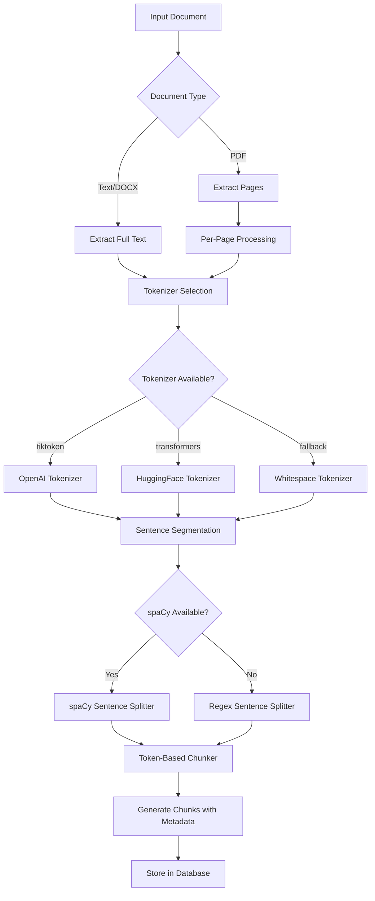

# Token-Based Chunking System

## Purpose

Token-based chunking provides superior control over LLM input size compared to character-based chunking. Since language models process text as tokens (not characters), token-aware chunking ensures:

- **Precise Context Window Management**: Each chunk fits within model token limits
- **Consistent Chunk Sizes**: Token counts are predictable regardless of text complexity
- **Better Semantic Preservation**: Sentence-aware splitting maintains meaning
- **Cost Optimization**: Accurate token counting enables precise cost estimation
- **Multi-Model Compatibility**: Works across different tokenizers (OpenAI, HuggingFace, etc.)

This system replaces character-based chunking with a robust token-based approach that respects sentence boundaries and provides detailed metadata for downstream processing.

---

## Architecture Overview



---

## Tokenizer Hierarchy

The system uses a fallback hierarchy to ensure robustness across different environments:

### 1. tiktoken (Primary)
- **Model**: `cl100k_base` (GPT-3.5/GPT-4 tokenizer)
- **Advantages**: Most accurate for OpenAI models, fast, deterministic
- **Fallback Condition**: Import failure or initialization error

```python
try:
    import tiktoken
    self.tokenizer = tiktoken.get_encoding("cl100k_base")
    self.tokenizer_type = "tiktoken"
except Exception:
    # Fall through to next option
```

### 2. HuggingFace Transformers (Secondary)
- **Model**: GPT-2 Fast Tokenizer
- **Advantages**: Open-source, widely compatible, fast
- **Fallback Condition**: tiktoken unavailable

```python
try:
    from transformers import AutoTokenizer
    self.tokenizer = AutoTokenizer.from_pretrained("gpt2", use_fast=True)
    self.tokenizer_type = "transformers"
except Exception:
    # Fall through to whitespace
```

### 3. Whitespace Tokenizer (Fallback)
- **Method**: Simple `text.split()` word counting
- **Advantages**: Always available, no dependencies
- **Limitations**: Approximate token counts (typically 75% of actual tokens)

```python
self.tokenizer = None
self.tokenizer_type = "whitespace"
```

---

## spaCy Sentence Segmentation

Accurate sentence splitting is critical for maintaining semantic coherence across chunk boundaries.

### Primary: spaCy NLP
```python
try:
    import spacy
    self.nlp = spacy.load("en_core_web_sm")
    self.sentence_splitter_type = "spacy"
except Exception:
    self.nlp = None
    self.sentence_splitter_type = "regex"
```

### Fallback: Regex Pattern
```python
SENTENCE_PATTERN = r'(?<=[.!?])\s+(?=[A-Z])'
sentences = re.split(SENTENCE_PATTERN, text)
```

---

## Token-Based Chunking Algorithm

### Overview

The algorithm processes text in three stages:
1. **Sentence Segmentation**: Split text into sentences
2. **Greedy Packing**: Pack sentences into chunks up to token limit
3. **Overlap Generation**: Add overlapping tokens between consecutive chunks

### Detailed Algorithm

```python
def _token_based_chunker(
    self,
    text: str,
    chunk_tokens: int = 900,
    overlap_tokens: int = 200,
    page_number: Optional[int] = None
) -> List[Dict[str, Any]]:
    """
    Token-based chunking with sentence awareness and overlap.
    
    Args:
        text: Input text to chunk
        chunk_tokens: Maximum tokens per chunk (default: 900)
        overlap_tokens: Token overlap between chunks (default: 200)
        page_number: PDF page number (optional)
        
    Returns:
        List of chunk dictionaries with metadata
    """
    
    # Step 1: Segment into sentences
    sentences = self._segment_sentences(text)
    
    chunks = []
    current_chunk_sentences = []
    current_token_count = 0
    global_token_offset = 0
    char_offset = 0
    
    for sentence in sentences:
        sentence_tokens = self._count_tokens(sentence)
        
        # Step 2: Check if adding sentence exceeds limit
        if current_token_count + sentence_tokens > chunk_tokens and current_chunk_sentences:
            # Finalize current chunk
            chunk_text = " ".join(current_chunk_sentences)
            chunks.append({
                "text": chunk_text,
                "token_count": current_token_count,
                "metadata": {
                    "chunk_index": len(chunks),
                    "start_token": global_token_offset,
                    "end_token": global_token_offset + current_token_count,
                    "char_offset_start": char_offset - len(chunk_text),
                    "char_offset_end": char_offset,
                    "chunk_method": "token_based",
                    "page_number": page_number
                }
            })
            
            # Step 3: Calculate overlap for next chunk
            overlap_sentences = []
            overlap_count = 0
            for sent in reversed(current_chunk_sentences):
                sent_tokens = self._count_tokens(sent)
                if overlap_count + sent_tokens <= overlap_tokens:
                    overlap_sentences.insert(0, sent)
                    overlap_count += sent_tokens
                else:
                    break
            
            # Reset for next chunk with overlap
            current_chunk_sentences = overlap_sentences
            current_token_count = overlap_count
            global_token_offset += (current_token_count - overlap_count)
        
        # Handle oversized sentences (> chunk_tokens)
        if sentence_tokens > chunk_tokens:
            # Split sentence by tokens
            split_chunks = self._split_oversized_sentence(
                sentence, 
                chunk_tokens, 
                overlap_tokens,
                global_token_offset,
                char_offset,
                page_number
            )
            chunks.extend(split_chunks)
            global_token_offset += sum(c["token_count"] for c in split_chunks)
            char_offset += len(sentence)
            current_chunk_sentences = []
            current_token_count = 0
        else:
            # Add sentence to current chunk
            current_chunk_sentences.append(sentence)
            current_token_count += sentence_tokens
            char_offset += len(sentence) + 1  # +1 for space
    
    # Finalize last chunk
    if current_chunk_sentences:
        chunk_text = " ".join(current_chunk_sentences)
        chunks.append({
            "text": chunk_text,
            "token_count": current_token_count,
            "metadata": {
                "chunk_index": len(chunks),
                "start_token": global_token_offset,
                "end_token": global_token_offset + current_token_count,
                "char_offset_start": char_offset - len(chunk_text),
                "char_offset_end": char_offset,
                "chunk_method": "token_based",
                "page_number": page_number
            }
        })
    
    return chunks
```

### Oversized Sentence Handling

When a single sentence exceeds `chunk_tokens`, split it by token boundaries:

```python
def _split_oversized_sentence(
    self,
    sentence: str,
    chunk_tokens: int,
    overlap_tokens: int,
    start_token_offset: int,
    start_char_offset: int,
    page_number: Optional[int]
) -> List[Dict[str, Any]]:
    """Split a sentence that exceeds token limit."""
    
    words = sentence.split()
    chunks = []
    current_words = []
    current_tokens = 0
    
    for word in words:
        word_tokens = self._count_tokens(word)
        
        if current_tokens + word_tokens > chunk_tokens and current_words:
            # Finalize chunk
            chunk_text = " ".join(current_words)
            chunks.append({
                "text": chunk_text,
                "token_count": current_tokens,
                "metadata": {
                    "chunk_index": len(chunks),
                    "start_token": start_token_offset,
                    "end_token": start_token_offset + current_tokens,
                    "char_offset_start": start_char_offset,
                    "char_offset_end": start_char_offset + len(chunk_text),
                    "chunk_method": "token_based",
                    "page_number": page_number,
                    "oversized_split": True
                }
            })
            
            start_token_offset += current_tokens
            start_char_offset += len(chunk_text) + 1
            current_words = []
            current_tokens = 0
        
        current_words.append(word)
        current_tokens += word_tokens
    
    # Add remaining words
    if current_words:
        chunk_text = " ".join(current_words)
        chunks.append({
            "text": chunk_text,
            "token_count": current_tokens,
            "metadata": {
                "chunk_index": len(chunks),
                "start_token": start_token_offset,
                "end_token": start_token_offset + current_tokens,
                "char_offset_start": start_char_offset,
                "char_offset_end": start_char_offset + len(chunk_text),
                "chunk_method": "token_based",
                "page_number": page_number,
                "oversized_split": True
            }
        })
    
    return chunks
```

---

## Overlap Logic

Overlap ensures context continuity between consecutive chunks:

### Overlap Calculation

```python
# After finalizing chunk N, calculate overlap for chunk N+1
overlap_sentences = []
overlap_count = 0

for sentence in reversed(current_chunk_sentences):
    sentence_tokens = self._count_tokens(sentence)
    if overlap_count + sentence_tokens <= overlap_tokens:
        overlap_sentences.insert(0, sentence)
        overlap_count += sentence_tokens
    else:
        break

# Start next chunk with overlap sentences
current_chunk_sentences = overlap_sentences
current_token_count = overlap_count
```

### Overlap Validation

Verify overlap correctness:

```python
# For chunks[i] and chunks[i+1]:
assert chunks[i+1]["metadata"]["start_token"] == \
       chunks[i]["metadata"]["end_token"] - overlap_tokens
```

---

## PDF Page-Aware Chunking

For PDF documents, preserve page boundaries for precise violation tracking.

### Page Extraction

```python
def extract_pdf_pages(file_path: str) -> List[str]:
    """Extract PDF as list of page texts."""
    import PyPDF2
    
    with open(file_path, 'rb') as f:
        pdf_reader = PyPDF2.PdfReader(f)
        pages = []
        for page_num in range(len(pdf_reader.pages)):
            page = pdf_reader.pages[page_num]
            pages.append(page.extract_text())
    
    return pages
```

### Per-Page Chunking

```python
async def _chunk_pdf(
    self,
    file_path: str,
    chunk_tokens: int,
    overlap_tokens: int
) -> List[Dict[str, Any]]:
    """Chunk PDF with page number tracking."""
    
    # Extract pages
    pages = self.content_parser.extract_pdf_pages(file_path)
    
    all_chunks = []
    global_chunk_index = 0
    
    for page_num, page_text in enumerate(pages, start=1):
        # Chunk each page separately
        page_chunks = self._token_based_chunker(
            page_text,
            chunk_tokens,
            overlap_tokens,
            page_number=page_num
        )
        
        # Update global chunk indices
        for chunk in page_chunks:
            chunk["metadata"]["chunk_index"] = global_chunk_index
            global_chunk_index += 1
        
        all_chunks.extend(page_chunks)
    
    return all_chunks
```

---

## Metadata Schema

Each chunk includes comprehensive metadata:

```python
{
    "text": "The actual chunk text...",
    "token_count": 850,  # Actual token count
    "metadata": {
        "chunk_index": 0,              # Global chunk index
        "start_token": 0,              # Starting token position
        "end_token": 850,              # Ending token position
        "char_offset_start": 0,        # Character offset start
        "char_offset_end": 1243,       # Character offset end
        "chunk_method": "token_based", # Chunking method identifier
        "page_number": 1,              # PDF page number (if applicable)
        "oversized_split": false,      # True if from oversized sentence
        "tokenizer_type": "tiktoken",  # Which tokenizer was used
        "sentence_count": 12           # Number of sentences in chunk
    }
}
```

### Metadata Field Descriptions

| Field | Type | Description |
|-------|------|-------------|
| `chunk_index` | int | Sequential chunk number (0-indexed) |
| `start_token` | int | Token position where chunk starts in document |
| `end_token` | int | Token position where chunk ends in document |
| `char_offset_start` | int | Character position (start) in original text |
| `char_offset_end` | int | Character position (end) in original text |
| `chunk_method` | str | Always `"token_based"` for this system |
| `page_number` | int\|null | PDF page number (1-indexed), null for non-PDF |
| `oversized_split` | bool | True if chunk is from splitting an oversized sentence |
| `tokenizer_type` | str | `"tiktoken"`, `"transformers"`, or `"whitespace"` |
| `sentence_count` | int | Number of sentences in the chunk |

---

## Testing Guidelines

### Unit Tests

```python
import pytest
from app.services.preprocessing_service import PreprocessingService

def test_basic_multi_chunk():
    """Test that long text generates multiple chunks."""
    service = PreprocessingService(db=mock_db)
    long_text = "This is a sentence. " * 200  # ~400 tokens
    
    chunks = service._token_based_chunker(long_text, chunk_tokens=100, overlap_tokens=20)
    
    assert len(chunks) > 1
    for chunk in chunks:
        assert chunk["token_count"] <= 100
        assert "chunk_method" in chunk["metadata"]
        assert chunk["metadata"]["chunk_method"] == "token_based"

def test_overlap_correctness():
    """Verify overlap tokens between consecutive chunks."""
    service = PreprocessingService(db=mock_db)
    text = "Sentence one. " * 100
    
    chunks = service._token_based_chunker(text, chunk_tokens=150, overlap_tokens=30)
    
    for i in range(len(chunks) - 1):
        current_end = chunks[i]["metadata"]["end_token"]
        next_start = chunks[i+1]["metadata"]["start_token"]
        overlap = current_end - next_start
        assert overlap == 30

def test_oversized_sentence():
    """Test handling of sentences exceeding chunk limit."""
    service = PreprocessingService(db=mock_db)
    huge_sentence = "word " * 1000  # Single sentence > 900 tokens
    
    chunks = service._token_based_chunker(huge_sentence, chunk_tokens=100)
    
    assert len(chunks) > 0
    for chunk in chunks:
        assert chunk["metadata"].get("oversized_split") == True
```

### Integration Tests

```python
async def test_pdf_page_aware_chunking():
    """Test PDF chunking with page numbers."""
    service = PreprocessingService(db=test_db)
    
    # Create test PDF with 2 pages
    pdf_path = create_test_pdf(["Page 1 content", "Page 2 content"])
    
    chunks = await service._chunk_pdf(pdf_path, chunk_tokens=900, overlap_tokens=200)
    
    # Verify page numbers assigned
    page_1_chunks = [c for c in chunks if c["metadata"]["page_number"] == 1]
    page_2_chunks = [c for c in chunks if c["metadata"]["page_number"] == 2]
    
    assert len(page_1_chunks) > 0
    assert len(page_2_chunks) > 0
```

---

## Requirements

### Python Dependencies

```txt
tiktoken>=0.4.0
transformers>=4.35.0
spacy>=3.5.0
PyPDF2>=3.0.0
pdfplumber>=0.7.5
```

### External Models

After installing requirements:

```bash
python -m spacy download en_core_web_sm
```

This downloads the English language model required for sentence segmentation.

---

## CLI Usage

### Basic Text Chunking

```bash
python scripts/token_chunker_cli.py \
    --file document.txt \
    --chunk_tokens 900 \
    --overlap 200 \
    --out chunks.json
```

### PDF Chunking

```bash
python scripts/token_chunker_cli.py \
    --file report.pdf \
    --is_pdf \
    --chunk_tokens 900 \
    --overlap 200 \
    --out pdf_chunks.json
```

### CLI Output Example

```
Token-Based Chunking Results
========================================
Input File: document.txt
Chunk Tokens: 900
Overlap Tokens: 200
Tokenizer Used: tiktoken

Results:
- Total Chunks: 15
- Average Token Count: 847.3
- Min Token Count: 234
- Max Token Count: 900

Output written to: chunks.json
```

### JSON Output Format

```json
[
    {
        "chunk_index": 0,
        "text": "This is the first chunk...",
        "token_count": 850,
        "start_token": 0,
        "end_token": 850,
        "page_number": null,
        "metadata": {
            "char_offset_start": 0,
            "char_offset_end": 1243,
            "chunk_method": "token_based",
            "tokenizer_type": "tiktoken",
            "sentence_count": 12
        }
    },
    ...
]
```

---

## Integration Plan

### Phase 1: Implementation ✓
- [x] Create documentation
- [x] Implement tokenizer hierarchy
- [x] Implement sentence segmentation
- [x] Build token-based chunker
- [x] Update PDF processing
- [x] Create test suite
- [x] Build CLI tool

### Phase 2: Testing
- [ ] Run unit tests
- [ ] Run integration tests
- [ ] Test CLI with sample documents
- [ ] Verify metadata correctness

### Phase 3: Deployment
- [ ] Update production requirements.txt
- [ ] Install spaCy model on server
- [ ] Deploy code changes
- [ ] Monitor chunking performance
- [ ] Validate against sample documents

### Phase 4: Migration
- [ ] Reprocess existing documents (optional)
- [ ] Update documentation
- [ ] Train team on new system
- [ ] Deprecate character-based chunking

---

## Benefits Over Character-Based Chunking

| Aspect | Character-Based | Token-Based |
|--------|----------------|-------------|
| **Accuracy** | Approximate | Exact token counts |
| **Model Compatibility** | Universal but imprecise | Tailored to specific models |
| **Cost Estimation** | Rough estimate | Precise calculation |
| **Chunk Consistency** | Variable token density | Consistent token limits |
| **Overlap Control** | Character overlap | Token overlap (more semantic) |
| **Metadata** | Limited | Rich (tokens, pages, sentences) |

---

## Troubleshooting

### Tokenizer Import Errors

**Error**: `ModuleNotFoundError: No module named 'tiktoken'`

**Solution**: Install dependencies and retry:
```bash
pip install -r requirements.txt
```

System will automatically fall back to transformers or whitespace tokenizer.

### spaCy Model Not Found

**Error**: `OSError: Can't find model 'en_core_web_sm'`

**Solution**: Download the language model:
```bash
python -m spacy download en_core_web_sm
```

System will fall back to regex-based sentence splitting if unavailable.

### Chunks Too Small/Large

**Problem**: Chunks are smaller or larger than expected

**Solution**: Adjust parameters:
```python
chunks = service._token_based_chunker(
    text,
    chunk_tokens=1200,  # Increase for larger chunks
    overlap_tokens=150   # Adjust overlap as needed
)
```

---

## Performance Considerations

### Tokenizer Performance

| Tokenizer | Speed (tokens/sec) | Accuracy | Dependencies |
|-----------|-------------------|----------|--------------|
| tiktoken | ~1,000,000 | Excellent | tiktoken |
| transformers | ~500,000 | Excellent | transformers, torch |
| whitespace | ~10,000,000 | Approximate (~75%) | None |

### Memory Usage

- **tiktoken**: ~50MB (encoding tables)
- **transformers**: ~500MB (model + tokenizer)
- **spaCy**: ~100MB (en_core_web_sm model)
- **whitespace**: Negligible

### Recommendations

- **Production**: Use tiktoken or transformers
- **Development**: Any tokenizer (whitespace acceptable for testing)
- **Resource-Constrained**: Whitespace tokenizer with manual calibration

---

## Future Enhancements

1. **Adaptive Chunking**: Dynamically adjust chunk size based on content complexity
2. **Semantic Chunking**: Use embeddings to find optimal semantic boundaries
3. **Multi-Language Support**: Add tokenizers and sentence splitters for other languages
4. **Chunk Deduplication**: Detect and merge duplicate chunks across documents
5. **Streaming Chunking**: Process large documents without loading entire text into memory
6. **Chunk Quality Metrics**: Score chunks based on semantic coherence

---

## References

- [tiktoken Documentation](https://github.com/openai/tiktoken)
- [HuggingFace Tokenizers](https://huggingface.co/docs/transformers/main_classes/tokenizer)
- [spaCy Sentence Segmentation](https://spacy.io/usage/linguistic-features#sbd)
- [OpenAI Tokenizer](https://platform.openai.com/tokenizer)

---

**Document Version**: 1.0  
**Last Updated**: 2025-12-11  
**Author**: Compliance Agent POC Team
